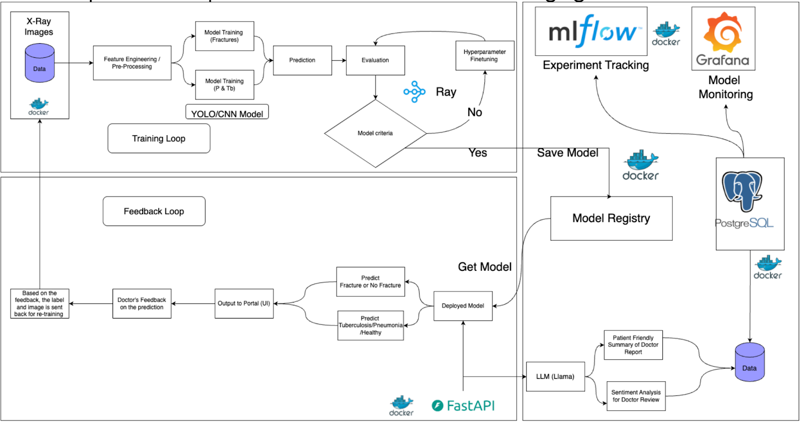

# Care Companion: Comprehensive AI-Powered Medical Imaging and Patient Care Solution

## Value Proposition
The  Care Companion system will be seamlessly integrated into existing healthcare practices, providing doctors with enhanced diagnostic tools. In traditional healthcare systems, radiologists face challenges analyzing numerous X-rays and CT scans, leading to delays, burnout, and missed diagnoses. By incorporating AI-powered image analysis, doctors can quickly identify fractures from X-rays, and detect signs of pneumonia and tuberculosis in chest X-rays, improving diagnostic accuracy. This AI-powered system will save time for healthcare professionals, enabling them to focus on patient care. It will enhance workflow in hospitals, clinics, and radiology centers, allowing healthcare providers to deliver faster, more reliable results with Real-time predictions and continuous feedback. 

The system's success will be evaluated based on its ability to enhance diagnostic accuracy, reduce operational costs, and improve patient satisfaction. However, in medical AI, where human lives are at stake, performance metrics prioritize patient safety over raw accuracy. While precision and AUC-ROC are tracked, we focus on optimizing the model for high recall (sensitivity) to minimize false negatives—ensuring no critical fracture, pneumonia, or TB case goes undetected, even at the cost of more false positives. This aligns with clinical best practices, where follow-up tests for potential false alarms are preferable to missed diagnoses. By balancing recall with clinician trust, we reduce liability risks while enabling early interventions that cut long-term costs.

While the AI-powered detection system enhances diagnostic accuracy, it should not be solely relied upon for final decisions. The predictions made by the system are assistance tools, and healthcare professionals should always validate the results through their expertise and further testing. We also employ a warning system that provides the confidence for each prediction made while also alerting the radiologist  that the predictions made can be incorrect and needs a thorough review before finalizing the report. Additionally, we create a dashboard that allows the technicians to monitor the data drift for any potential flaws in the system. 

## Contributors
| Name                   | Responsible For | Link to their commits in this repo                                                       |
|------------------------|-----------------|------------------------------------------------------------------------------------------|
| Satyam Chatrola         | Model Serving and Monitoring |[Commits](https://github.com/care-ai-mlops/care-companion/commits/main/?author=Nightshade14) |
| Akash Peddaputha        | Data Pipeline |[Commits](https://github.com/care-ai-mlops/care-companion/commits/main/?author=akashp04)|
| Yash Patel              | Continuous X Pipeline |[Commits](https://github.com/care-ai-mlops/care-companion/commits/main/?author=YashPatel166)|
| Mamidala Sai Sandeep    | Model Training |[Commits](https://github.com/care-ai-mlops/care-companion/commits/main/?author=Sandeep2229)|

## System Design

## Summary of outside materials

<!-- In a table, a row for each dataset, foundation model. 
Name of data/model, conditions under which it was created (ideally with links/references), 
conditions under which it may be used.-->

| Entity | How it was created | Conditions of use |
| :-- | :-- | :-- |
| **Dataset - 1: Wrist X-Ray images** | The dataset is sourced from Kaggle. It contains X-Ray images of wrists. The class distribution of X-rays is equal between fractured and normal non-fractured wrists. The dataset has X-ray images in PA, oblique and lateral projections and for left and right wrists making it robust and covers all major cases. The dataset's balanced nature will mitigate potential bias in model training, while its variety of projection angles will enhance the model's generalizability to real-world clinical scenarios where X-rays may be captured from different orientations. The dataset consists of 12.7K images which totals in size of 7.82 GB. The dataset link is as follows: https://www.kaggle.com/datasets/sirajbunery/wrist-xray-dataset-balanced-data | Open-source  To train fracture detection models. |
| **Dataset - 2: Chest X-Ray images** | Data Sources OCT Dataset (Kermany): 4,273 pneumonia-infected and 1,583 normal X-rays. RSNA CXR Dataset: 3,500 TB-positive X-rays. NIAID TB Dataset: 3,499 TB-positive X-rays from seven countries. NLM Dataset: Montgomery: 138 X-rays (57 TB, 80 normal). Shenzhen: 662 X-rays (336 TB, 326 normal). Belarus Dataset: 304 TB-infected X-rays (512×512 resolution) Non-X-ray Dataset: 1,357 images of objects (e.g., animals, bikes) from Pavan Sanagapati. Sources Kermany DS, Goldbaum M, Cai W, et al. Identifying medical diagnoses and treatable diseases by image-based deep learning. Cell. 2018;172(5):1122-1131.e9. doi:10.1016/j.cell.2018.02.010 Radiological Society of North America. Published August 27,2018.Accessed December 10.2024. https://www.kaggle.com/competitions/rsna-pneumonia-detection-challenge National Institute of Allergy and Infectious Diseases (NIAID). NIAID TB Portals Dataset. Accessed February 10, 2024. Available at: https://tbportals.niaid.nih.gov/download-data Jaeger S, Candemir S, Antani S, Wáng YX, Lu PX, Thoma G. Two public chest X-ray datasets for computer-aided screening of pulmonary diseases. Quant Imaging Med Surg. 2014;4(6):475-477. doi:10.3978/j.issn.2223-4292.2014.11.20 Gabrielian A, Engle E, Harris M, et al. Comparative analysis of genomic variability for drug-resistant strains of Mycobacterium tuberculosis: The special case of Belarus. Infect Genet Evol. 2020;78:104137. doi:10.1016/j.meegid.2019.104137 Sanagapati P, Images Dataset. Kaggle. Published 7 years ago. Accessed December3,2024. https://www.kaggle.com/datasets/pavansanagapati/images-dataset/data  The dataset has 15.3K images and is of size 7.02 GB.  Dataset link: https://www.kaggle.com/datasets/rifatulmajumder23/combined-unknown-pneumonia-and-tuberculosis | Open-source  To train Pneumonia and Tuberculosis detection models. |
| **Model - 1: CNN** | We plan to experiment with multiple pre-trained CNN backbone architectures like DenseNet-121, InceptionV3/V2, MobileNet etc for fracture detection. The transfer learning approach is the most efficient way of training the models for our use-case. | Used to detect bone fracture in the X-Ray images uploaded by Radiology technician |
| **Model - 2: CNN** | Similarly for Tuberculosis or Pneumonia detection, we plan to use Transfer Learning technique and fine-tune pre-trained models to make predictions. | Used to detect Tuberculosis and Pneumonia in the X-Ray images uploaded by Radiology technician |
| **Model-3: LLM** | We plan to use a self-hosted open-source LLM such as Llama for the notes generation part and/or patient care review sentiment classification. If we use Llama, it reduces the work of fine-tuning as they might have already been trained on such data. | Open-source  Used to generate patient friendly clinical notes and/or patient care review sentiment classification. |

`Difficulty Points` Attempting from Unit-1:
<ul> <li>Using Multiple Models</li> </ul>

### Summary of Infrastructure Requirements
| **Requirement**      | **How many / When**                      | **Justification**                                                                                                                                     |
|----------------------|------------------------------------------|------------------------------------------------------------------------------------------------------------------------------------------------------|
| `m1.medium`          | 1 instance, running 24/7                | Used for **backend tasks** such as **PostgreSQL database**, **logging**, and light processing that doesn't require heavy GPU acceleration. This is a lightweight node to handle non-GPU tasks. |
| `gpu_v100`           | 4-hour block, twice a week               | **High-performance model training** for deep learning tasks (e.g., CNN, Vision Transformers). The **V100** provides excellent compute power for training large models on complex datasets. |
| `gpu_a30`            | 4-hour block, 3-4 times a week for inference | **Low-latency inference** for real-time AI predictions (fracture detection, pneumonia, TB). The **A30** provides efficient inference for production with cost-effectiveness. It can handle large models and datasets. |
| **Floating IPs**     | 1-2 for public access to inference model | To provide access to the **AI-powered inference service** (e.g., API for predictions) via a **public-facing IP** for external users (doctors, hospitals, etc.). |
| **Persistent Storage**| 1TB SSD (for model, dataset, and logs)  | To store models, large datasets, and logs used in training and inference. The SSD ensures **fast read/write** speeds necessary for processing large medical images. |

## Modeling
### Chest X-ray Pipeline
#### Task: Classify chest X-ray images into medical categories (NORMAL, PNEUMONIA, etc.).
 - Inputs: Single 224x224 grayscale X-ray image.
 - Outputs: Class label.
 - Model: Pretrained ResNet18 / ResNet50 / EfficientNetB1 / EfficientNetB4 with custom fully connected head.
#### Why this model?
 - ResNet + EfficientNet architectures perform well on medical imaging.
 - Pretrained models accelerate convergence and generalize better for small datasets.

### Wrist X-ray Pipeline
#### Task: Detect wrist fractures from 2-view X-ray images (e.g. PA + lateral).
 - Inputs: Two grayscale images (1-channel each), each 224x224.
 - Outputs: Fracture or non-fracture class.
 - Model: Custom MultiViewPreTrainedModel combining two timm backbones (e.g. ResNet18 + EfficientNetB0).
#### Why this model?
 - 2-view radiographs provide complementary diagnostic information.
 - timm models offer state-of-the-art backbones with flexible architecture choices.
 - Ray scaling allows distributed training on large datasets.

##### Chest X-ray (chest-xray-trainer.py)
 - Initial Training (fit_initial()):
  - Freeze backbone, train only classifier head.
 - Fine-tuning (fit_fine_tune()):
  - Unfreeze entire model and train full network.

 - Retraining is triggered by running the script again when new data arrives:
  - `python chest-xray-trainer.py --root /mnt/object/chest-data`
##### Wrist X-ray (test_wrist_trainer.py)
 - Fully distributed pipeline using Ray's TorchTrainer().
 - Two-stage:
  - Classifier training (frozen backbone)
  - Full fine-tuning (all layers)
  - Triggered via Ray cluster job:
### Experiment Tracking
  - Both pipelines integrate with MLflow Tracking Server.
  - Tracked metrics include:
   - Accuracy (Train & Val)
   - Loss (Train & Val)
   - Recall
   - Training time

GPU information 
`Difficulty Points` Attempting from Unit-4 & Unit-5:
<ul> <li>Using ray Train </li> </ul>

#### Model serving 
##### API Endpoint: 
We will wrap our models in a FastAPI endpoint for real-time inference (e.g., fracture detection, pneumonia, TB). FastAPI is chosen for its speed and async capabilities, which are crucial for handling real-time inference requests with minimal latency (1-2 seconds per image). 
<ul>
 <li>Size: Models will range from 100MB to 200MB (CNNs for image detection).</li>
 <li>Throughput: 50-100 images per minute for batch inference.</li>
 <li>Latency: 1-2 seconds per image for online inference.</li>
 <li>Concurrency: Support 50-100 concurrent requests for multiple users (doctors)</li>
</ul>

#### Model Optimizations:
##### Quantization: 
<ul>
 <li> We’ll explore reducing model precision (16-bit or 8-bit) for faster inference with minimal accuracy loss (only for LLM).</li>
 <li> TensorRT: Use optimized operators for NVIDIA GPUs to accelerate inference.</li> 
</ul>
TensorRT and quantization are linked to the model serving process for efficient inference as Medical imaging models need to be accurate while being light enough to serve in real-time.

#### System Optimizations:
##### Load Balancing: 
Distribute inference requests across multiple servers to ensure scalability.
##### GPU Utilization: 
Use Ray for job distribution across GPUs to maximize resource use.

Ray and load balancing ensure that we can scale concurrently without compromising latency. With multiple doctors accessing the system simultaneously, it is essential to distribute load and optimize GPU utilization.

#### Evaluation and Monitoring
##### Offline Evaluation: 
Immediately after model training, we will perform offline evaluations focusing on the recall metric to prioritize minimizing false negatives, which is critical for healthcare applications. We will evaluate models on fracture detection, pneumonia, and tuberculosis detection using 10,000 and 8,000 images, respectively.  
All evaluation metrics, including recall, will be logged using the MLFlow metric logger for tracking, comparison, and visualization of results across different models.
Models meeting the required recall threshold will be automatically registered in the MLFlow model registry for deployment. If performance is inadequate, the model will be flagged for retraining.

##### Load Testing: 
We will use FastAPI to simulate multiple concurrent inference requests. We will deploy the model to the staging environment and use FastAPI’s async capabilities to handle 50-100 concurrent requests. The system’s performance will be evaluated by measuring latency, throughput, and resource usage (CPU/GPU/memory) during both batch and online inference tasks.

##### Canary testing & Continuous feedback: 
In canary testing, the model will be deployed to a small subset of real users, allowing us to evaluate its performance in a live environment. The continuous feedback loop will collect doctor feedback on predictions, using this data to retrain the model periodically and improve its accuracy over time.

`Difficulty Points` Attempting from Unit-6 & Unit-7:
<ul> <li> We will build a dashboard for the engineers to be able to look into the data drift during re-training to ensure that the model is working as expected.</li> 
 <li>We will also monitor the model through the same dashboard to check the model health. </li>
</ul>

## Data Pipeline 

### Persistent Storage Object Store and Block Store:
#### Dataset SetUp
- **Location**: `chi_tacc:object-persist-project51/`
- **Total Size**: 22GB (2 datasets)
- **Contents**:
  - Wrist X-ray dataset (15.82 GB)
  - Chest X-ray dataset (7.02 GB)
  - Re-Training Data
### Offline Data
#### Wrist X-ray Dataset
- **Source**: [Wrist X-ray Dataset](https://figshare.com/articles/dataset/GRAZPEDWRI-DX/14825193)
- **Size**: ~20k images (~15 GB)  
- ** Image Types **
 - PA (Posteroanterior) projections
 - Lateral projections
- ** Ground Truth **
 - Radiologist-annotated fracture labels

#### Chest X-ray Dataset 
- **Source**: [Kaggle Wrist X-ray Dataset](https://www.kaggle.com/datasets/rifatulmajumder23/combined-unknown-pneumonia-and-tuberculosis)
- **Size**: ~12k images (~6.5GB)  
  **Image Types**: Primarily **Posterior-Anterior (PA)** chest X-rays  
- **Ground Truth**: Each image is labeled as:
  - `Pneumonia`
  - `Tuberculosis`
  - `Normal`  
  Labels are aggregated from multiple original datasets curated for this compilation.
 
PostgreSQL for patient, doctor, and interaction data, with data stored in persistent volumes to ensure durability and ease of management. This database will manage:
<ul>
 <li><strong>Patient Information</strong>: ID, name, age, medical history.</li>
 <li><strong>Doctor Information</strong>: ID, name, specialties, and consultation records.</li>
 <li><strong>Interactions</strong>: Records of patient visits and model predictions.</li>
 <li><strong>Training artifacts</strong>, models, and container images will be similarly managed in Docker to ensure portability and flexibility.</li>
</ul>

#### Training Artiacts
- **Location**: `block-persist-project51/`
- **Size**: Used `30GB`
- Has Data of MLFlow, MinIO, Postgres, Prometheus, Grafana

### ETL Pipelines (Offline Data)
Transform data by applying feature engineering for structured data and validation for both.  
#### Chest X-Ray ETL Pipeline
##### Extract Stage (`extract-data`)
- Runs a **Python 3.10 slim container**.
- Mounts `chest-data` (shared data) and `~/.kaggle` (Kaggle credentials).
- Installs the Kaggle CLI and downloads the dataset:
  [Kaggle Data](https://www.kaggle.com/datasets/rifatulmajumder23/combined-unknown-pneumonia-and-tuberculosis).
- Unzips the dataset into the shared volume for downstream use.
##### Transform Stage (`transform-data`)
- Runs in a **Python 3.10 slim container**.
- Mounts `chest-data` and the local project folder `care-companion`.
- Flattens nested folders if present.
- Installs `pandas` and runs `src/rearrangechestdata.py`:
    - Restructures dataset into `/data/train/` and `/data/test/` folders.
    - Prepares data for machine learning workflows.
- Lists folder contents for verification.
##### Load Stage (`load-data`)
- Uses an official **`rclone` image**.
- Mounts `chest-data` and the `rclone.conf` credentials file.
- Deletes any existing dataset in the remote storage bucket.
- Uploads the processed dataset to the cloud bucket using `rclone copy`.
- Lists the top-level folders for confirmation.

#### Wrist X-Ray ETL Pipeline
##### Extract Stage (`extract-data`)
- Runs in a **Python 3.10 slim container**.
- Uses a Figshare personal token (`TOKEN` env variable) for authentication.
- Downloads dataset files from Figshare using the API and unzips them into `/data/wrist-xray/14825193/`.
- Handles downloading multiple files and large dataset archives.
##### Transform Stage (`transform-data`)
- Runs in a **Python 3.10 slim container**.
- Mounts the local dataset folder.
- Installs `pandas` for CSV parsing.
- Reads `dataset.csv` to map image files to fracture labels.
- Moves images into two folders: `FRACTURE` and `NOT_FRACTURE` based on the label `fracture_visible`.
- Cleans up the directory structure:
    - Moves the dataset CSV to the parent folder.
    - Removes empty folders if applicable.
    - Outputs status messages for verification.
##### Load Stage (`load-data`)
- Uses the official **`rclone` image**.
- Mounts the dataset folder and `rclone.conf` credentials file.
- Deletes any existing dataset in the remote storage bucket (`chi_tacc:$RCLONE_CONTAINER/wrist-data`).
- Uploads the processed dataset to the cloud using `rclone copy`.
- Lists the top-level folders in the remote bucket for verification. 

### Preparing Dataloaders for Training:
- Resizes all images to a fixed size (default 224x224).
- Loads all dataset splits (train, val, test, canary_testing_data, production_data).
- Adds data augmentation (flip + brightness/contrast changes) for train data if enabled.
- Shuffles train data for better training.
- Uses pin_memory for faster data loading on GPU.
- The Splits are designed in this way: 
  - **Train**: 80% of data
  - **Validation**: 8% of data
  - **Test**: 10% of data
  - **Canary Testing**: 1% of data
  - **Production**: 1% of data

## Online Data Pipeline

#### Architecture Overview
1. **FastAPI Inference Server**
   - Endpoints:
     - `/predict_chest`: Chest X-ray analysis
     - `/predict_wrist`: Wrist X-ray analysis
   - Features:
     - Real-time image preprocessing
     - Batch processing support
     - Health monitoring
     - Prometheus metrics integration
2. **Triton Inference Server**
   - Model serving with GPU acceleration
   - Dynamic batching
   - Model versioning
   - Health checks and monitoring

 3. All the incoming data would be directly written to Object Storage at the CHI@TACC and stored in folders based on the True Label (User Input; different from the predicted Label)
 4. The Predicted and Truth Labels would be Stores into `.csv` file which would then be used to rearrange the data
 5. Later, Using the above splits the data would be rearranged and then sent for re-training 

`Difficulty Points` Attempting from Unit-6 & Unit-7:
<ul> <li> The Dashboard would be taking data from the csv files in the object store to display about the data </li></ul>

#### Continuous X pipeline 
##### Infrastructure-as-code: 
Terraform will be used to define, provision, and manage the entire cloud infrastructure, including servers, load balancers, storage, and networking, in a version-controlled manner. The infrastructure configuration will be stored in Git and maintained using version control.
Terraform enables reproducibility and consistency, allowing us to automate the provisioning and management of infrastructure, reducing human errors and ClickOps. It allows for easy rollback and updates, which is critical when updating cloud infrastructure. 
##### Cloud-native:
Infrastructure configurations will be defined in version-controlled Git repositories using Infrastructure-as-Code (IaC) tools such as Terraform. 
The project will be broken down into small, independently deployable microservices. These microservices will be responsible for distinct tasks, such as X-ray fracture detection, TB/pneumonia detection, and patient notes generation. Each microservice will communicate with the others via APIs, typically RESTful APIs.
 All services, including machine learning models and associated APIs, will be containerized using Docker. This will enable the services to be packaged with their dependencies and run consistently across different environments.  
##### CI/CD and continuous training:
We will set up a CI/CD pipeline to automate the entire process of training, testing, and deploying machine learning models. The pipeline will be integrated with GitHub Actions to automatically trigger workflows for each phase whenever there is a change in the codebase or a new dataset becomes available.
Using GitHub Actions ensures that every change in the codebase or dataset will automatically trigger the appropriate pipeline, ensuring that no manual intervention is needed. 
##### Staged deployment:
By using staging, canary, and production environments, we minimize risk by thoroughly testing the model at each stage, ensure scalability and reliability in live settings, and maintain high performance throughout the deployment lifecycle.

